# ⚖️ Arbitra - Decentralized Legal Dispute Resolution Platform

**Built on Internet Computer Protocol for LegalHack 2025**

Arbitra is a blockchain-based platform that revolutionizes legal dispute resolution through decentralized arbitration, AI-powered analysis, cryptographic evidence verification, and Bitcoin escrow integration.

## ✨ Lovable Cloud Compatible

**This application now works with Lovable Cloud preview!** The frontend includes mock authentication and data storage for seamless development in Lovable. For full ICP functionality, deploy the backend canisters locally using the steps below.

## Quick Start with Lovable

To run this project in Lovable Cloud:

```bash
npm install
npm run dev
```

The app will start with mock authentication and local storage. No backend deployment needed for preview!

## Quick Start Guide (Full ICP Deployment)

### Prerequisites

- [DFINITY SDK (dfx)](https://internetcomputer.org/docs/current/developer-docs/setup/install) v0.14.0+
- [Node.js](https://nodejs.org/) v16+
- [pnpm](https://pnpm.io/) or npm

### Local Deployment Steps

1. **Install DFINITY SDK**
   ```bash
   sh -ci "$(curl -fsSL https://sdk.dfinity.org/install.sh)"
   ```

2. **Start Local ICP Replica**
   ```bash
   dfx start --background --clean
   ```

3. **Deploy All Canisters**
   ```bash
   chmod +x deploy.sh
   ./deploy.sh
   ```

4. **Configure Environment**
   
   Copy canister IDs from deployment output to `.env`:
   ```bash
   ARBITRA_BACKEND_CANISTER_ID=<from-deployment-output>
   EVIDENCE_MANAGER_CANISTER_ID=<from-deployment-output>
   AI_ANALYSIS_CANISTER_ID=<from-deployment-output>
   BITCOIN_ESCROW_CANISTER_ID=<from-deployment-output>
   DFX_NETWORK=local
   ```

5. **Access Application**
   
   Open the URL shown in deployment output (typically `http://localhost:4943?canisterId=<frontend-canister-id>`)

## Technical Overview

Arbitra is a **fully decentralized** legal dispute resolution platform built on the Internet Computer Protocol (ICP). The system architecture consists of:

- **4 Backend Canisters** (Motoko smart contracts)
- **React Frontend** deployed on ICP Assets Canister
- **Internet Identity** for authentication
- **Bitcoin Chain Fusion** for escrow
- **Constellation Network** for evidence anchoring

### System Architecture Overview

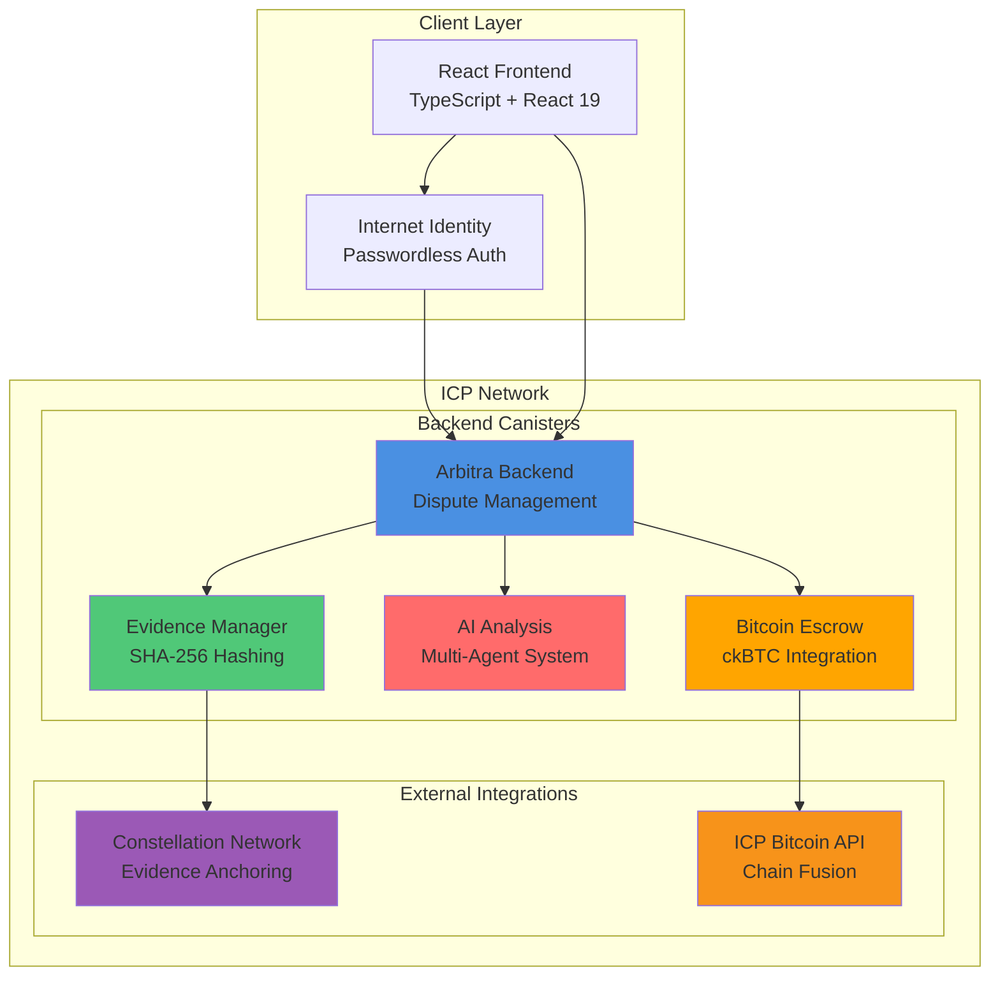

### Technology Stack Diagram

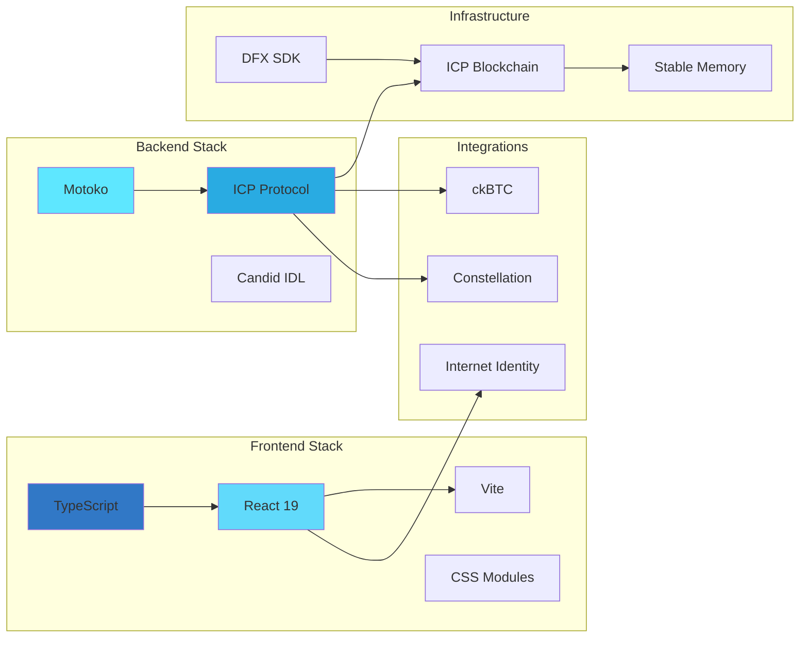

### Complete System Data Flow

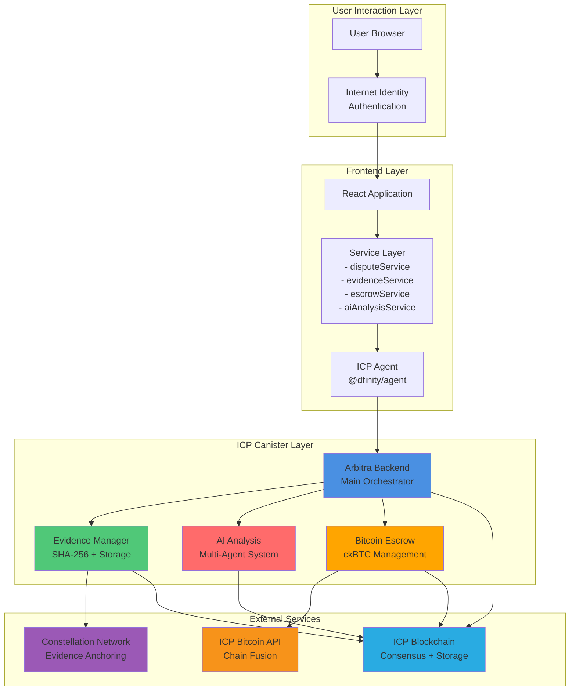

---

## Table of Contents

1. [Project Overview](#project-overview)
2. [Problem Statement](#problem-statement)
3. [Solution Architecture](#solution-architecture)
4. [Core Features](#core-features)
5. [Technical Stack](#technical-stack)
6. [Backend Architecture](#backend-architecture)
7. [Frontend Architecture](#frontend-architecture)
8. [Smart Contract Canisters](#smart-contract-canisters)
9. [AI Analysis Engine](#ai-analysis-engine)
10. [Evidence Management System](#evidence-management-system)
11. [Bitcoin Escrow Integration](#bitcoin-escrow-integration)
12. [Internet Identity Integration](#internet-identity-integration)
13. [Constellation Network Integration](#constellation-network-integration)
14. [Installation Guide](#installation-guide)
15. [Deployment Instructions](#deployment-instructions)
16. [API Reference](#api-reference)
17. [Security Considerations](#security-considerations)
18. [Performance Metrics](#performance-metrics)
19. [Future Enhancements](#future-enhancements)
20. [Business Model](#business-model)
21. [LegalHack 2025 Alignment](#legalhack-2025-alignment)
22. [Troubleshooting](#troubleshooting)
23. [Contributing](#contributing)
24. [License](#license)

---

## Project Overview

### Vision

Arbitra envisions a future where legal disputes are resolved efficiently, transparently, and accessibly through decentralized systems powered by artificial intelligence. By leveraging blockchain technology, we eliminate intermediaries, reduce costs, and create auditable records of all dispute proceedings.

### Mission

Our mission is to democratize legal dispute resolution by building infrastructure that allows parties anywhere in the world to resolve conflicts quickly and fairly, regardless of geographic boundaries or access to traditional legal systems.

### Key Metrics

- **Resolution Time**: Days instead of months (90% faster than traditional arbitration)
- **Cost Reduction**: 80% cheaper than traditional legal fees
- **Transparency**: 100% immutable audit trail on-chain
- **Accessibility**: Available to anyone with internet connection and wallet

### Target Users

1. **Digital Businesses**: E-commerce platforms, SaaS companies, marketplaces needing dispute resolution
2. **DeFi Protocols**: Decentralized exchanges, lending platforms, NFT marketplaces
3. **Enterprises**: Companies using smart contracts for supply chain, IP licensing, service agreements
4. **Legal Professionals**: Arbitrators and mediators seeking modern tools to increase efficiency
5. **Individuals**: Parties in international disputes needing neutral arbitration

---

## Problem Statement

### Current Arbitration Challenges

#### High Costs
Traditional arbitration requires engagement of legal counsel, expert witnesses, and arbitrators, resulting in costs ranging from $10,000 to $50,000+ for disputes over modest amounts. These costs are prohibitive for small businesses and individuals.

#### Extended Timeline
Most arbitration proceedings take 6-12 months from filing to resolution, during which parties must continue conducting business amid uncertainty. This extended timeline increases business disruption and financial burden.

#### Opacity and Lack of Transparency
In traditional systems, parties have limited visibility into how decisions are made. Arbitration proceedings are often confidential, preventing parties from understanding the reasoning behind rulings or learning from precedent.

#### Geographic Limitations
International disputes face jurisdictional challenges, varying legal frameworks, and enforcement difficulties. Parties must navigate complex rules about which country's law applies and where judgments can be enforced.

#### Difficulty in Evidence Verification
In digital commerce, determining whether evidence has been tampered with is nearly impossible. Without cryptographic verification, disputes often hinge on "he said, she said" without definitive proof.

#### AI-Driven Bias
Decisions made by AI systems can perpetuate or amplify existing biases in legal outcomes, particularly against marginalized communities or parties from non-traditional legal backgrounds.

### Data Supporting the Problem

- **Global Dispute Resolution Market**: $45B annually, growing at 8% CAGR
- **Unresolved Cross-Border Disputes**: 60% of digital commerce disputes go unresolved due to friction
- **SMB Legal Costs**: Small businesses spend 5-10% of revenue on legal compliance and dispute resolution
- **Web3 Disputes**: Over $2B in locked or disputed funds across DeFi protocols, with no standardized resolution mechanism

---

## Solution Architecture

### High-Level Overview

Arbitra operates as a **hybrid human-AI dispute resolution system** deployed entirely on the Internet Computer Protocol. The architecture combines:

1. **Decentralized On-Chain Storage**: All data stored on ICP canisters with cryptographic verification
2. **AI-Powered Analysis**: Machine learning models analyze evidence and generate preliminary decisions
3. **Human Arbitration**: Certified arbitrators review AI recommendations and make final rulings
4. **Trustless Escrow**: Bitcoin-backed escrow ensures funds are released only upon ruling
5. **Immutable Evidence**: Constellation Network provides tamper-proof evidence anchoring

### System Flow Sequence Diagram

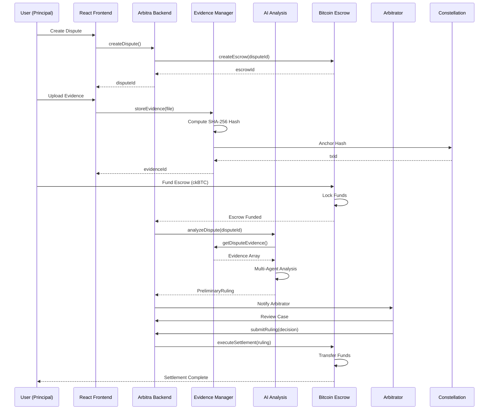

### State Machine Diagram

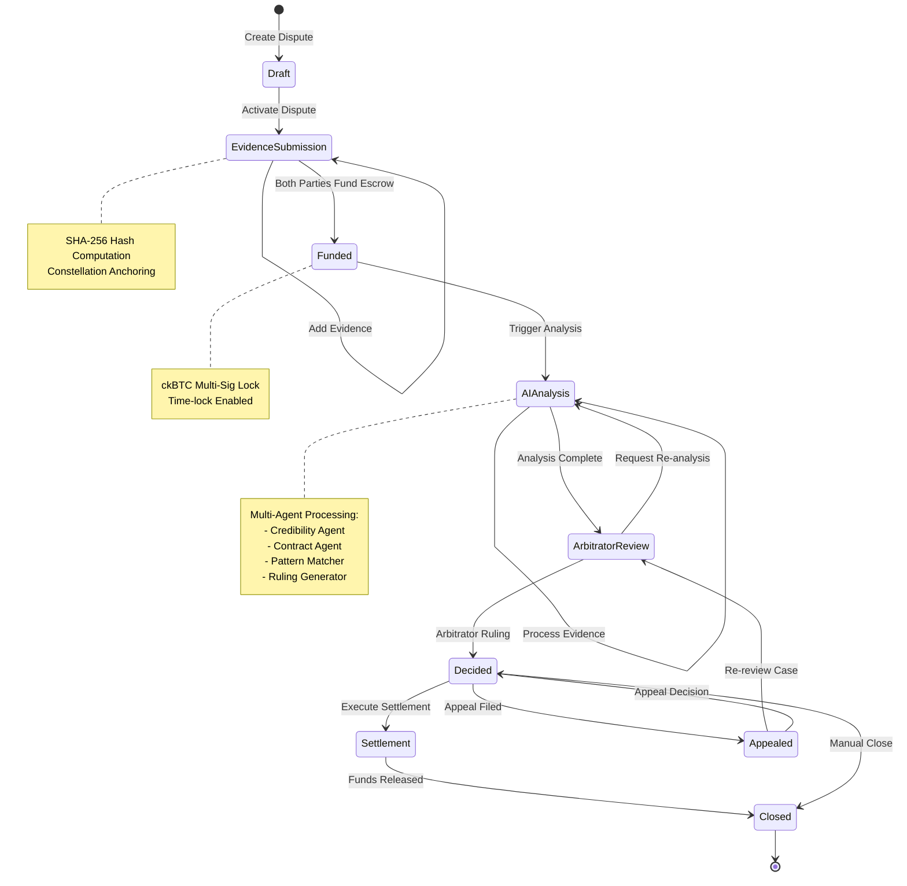

### System Flow Diagram

```
┌─────────────────────────────────────────────────────────┐
│                    User Interface                        │
│           (React Frontend on ICP Assets)                │
└────────────────┬────────────────────────────────────────┘
                 │
                 ├─────────────────────────────────────────┐
                 │                                         │
        ┌────────▼─────────┐                  ┌────────────▼────────┐
        │   Internet        │                  │ Dispute Creation    │
        │   Identity Auth   │                  │ Evidence Upload     │
        └────────┬─────────┘                  └────────────┬────────┘
                 │                                         │
                 └────────────────────────────────────────┬┘
                                                          │
                 ┌────────────────────────────────────────▼─────────────┐
                 │      Arbitra Backend (Main Canister)                │
                 │  - Dispute Management                              │
                 │  - User Profile Management                         │
                 │  - Case Status Tracking                            │
                 └────────────────────────────────────────┬────────────┘
                                                          │
        ┌─────────────────────────┬──────────────────────┬─────────────────┐
        │                         │                      │                 │
    ┌───▼───┐           ┌────────▼──────┐      ┌────────▼──────┐   ┌─────▼────┐
    │Evidence│           │  AI Engine    │      │Bitcoin Escrow │   │Arbitrator│
    │Manager │           │  Canister     │      │   Canister    │   │ Registry │
    │Canister│           │               │      │               │   │Canister  │
    └───┬───┘           └────────┬──────┘      └────────┬───────┘   └─────┬────┘
        │                        │                      │                 │
    ┌───▼───┐           ┌────────▼──────┐      ┌────────▼───────┐      │
    │Const.  │           │Constellation  │      │  ICP Native   │       │
    │Network │           │ Hypergraph    │      │  Bitcoin API  │       │
    │        │           │               │      │  (Chain Fusion)       │
    └────────┘           └────────────────┘      └────────────────┘      │
                                                                          │
                                                            ┌─────────────▼┐
                                                            │  Human      │
                                                            │  Arbitrator │
                                                            │  Review     │
                                                            └─────────────┘
```

### User Journey

```
STEP 1: DISPUTE CREATION
├─ User authenticates with Internet Identity (no passwords)
├─ Fills dispute creation form with details
│  ├─ Title and description
│  ├─ Defendant/respondent principal
│  ├─ Amount in dispute
│  ├─ Currency (USD, ICP, ckBTC)
│  └─ Governing law and arbitration clause
├─ Canister creates dispute record with status: DRAFT
└─ Initial escrow account established

STEP 2: EVIDENCE SUBMISSION PERIOD
├─ Both parties upload evidence files
│  ├─ Contracts and agreements
│  ├─ Chat logs and communications
│  ├─ Transaction records and receipts
│  ├─ Expert reports and analyses
│  └─ Other supporting documentation
├─ System generates SHA-256 hash for each file
├─ Hash anchored to Constellation Hypergraph for verification
├─ Dispute status changes to: EVIDENCE_SUBMITTED
└─ Chain-of-custody maintained with timestamps

STEP 3: ESCROW FUNDING
├─ Both parties fund escrow with disputed amount
├─ Funds held in secure ckBTC smart contract
├─ Multi-signature mechanism requires consent
├─ Dispute status changes to: FUNDED
└─ Platform fee collected (1-5% depending on tier)

STEP 4: AI ANALYSIS
├─ AI engine receives all evidence
├─ Multi-agent system analyzes case
│  ├─ Evidence Credibility Agent
│  ├─ Contract Clause Identifier Agent
│  ├─ Legal Pattern Matcher Agent
│  └─ Ruling Generator Agent
├─ System generates preliminary ruling with reasoning
├─ Confidence score calculated (0.0 - 1.0)
├─ Key factors and legal references identified
└─ Dispute status changes to: ANALYSIS_COMPLETE

STEP 5: ARBITRATOR REVIEW
├─ Human arbitrator assigned based on expertise match
├─ Arbitrator reviews AI analysis and raw evidence
├─ Can override AI recommendation if warranted
├─ Provides reasoning for final decision
├─ Confirms ruling on-chain
└─ Dispute status changes to: DECISION_READY

STEP 6: SETTLEMENT EXECUTION
├─ Smart contract receives arbitrator's ruling
├─ Funds automatically transferred to winner(s)
│  ├─ Plaintiff receives award (if won)
│  ├─ Defendant receives refund (if won)
│  ├─ Split allocation (if split decision)
│  └─ Platform fees collected
├─ All parties notified of settlement
├─ Transaction immutably recorded on-chain
└─ Dispute status changes to: SETTLED

STEP 7: APPEAL & ENFORCEMENT
├─ Parties can appeal within 14 days
├─ Appeal canister creates new review
├─ Enforcement mechanisms for non-compliance
│  ├─ Public record of non-payment
│  ├─ Credit score impact via third parties
│  └─ DAO governance for serious violations
└─ Dispute status changes to: APPEALED or CLOSED
```

---

## Core Features

### 1. Dispute Management

#### Feature Overview
Complete dispute lifecycle management from creation to resolution with transparent status tracking.

#### Key Capabilities

**Dispute Creation**
- Structured form-based dispute filing
- Support for multiple dispute types (contract breach, payment, service quality, IP disputes)
- Defined arbitration clauses and governing law specification
- Automatic assignment of unique dispute ID

**Dispute Tracking**
- Real-time status updates visible to all parties
- Complete history of all actions and communications
- Milestones and deadline tracking
- Progress percentage calculation

**Multi-Party Management**
- Support for 2+ party disputes (future feature for consortium disputes)
- Role-based access control (plaintiff, defendant, arbitrator)
- Confidentiality controls for sensitive information
- Notification system for all parties

**Dispute Types**
```
1. PAYMENT_DISPUTE
   - Unpaid invoices
   - Billing discrepancies
   - Refund disagreements

2. SERVICE_QUALITY
   - Delivered service below standard
   - Incomplete deliverables
   - Quality of work disputes

3. CONTRACT_BREACH
   - Non-performance of obligations
   - Late delivery or performance
   - Violation of contract terms

4. INTELLECTUAL_PROPERTY
   - Copyright infringement claims
   - Patent disputes
   - Trademark conflicts

5. DATA_OWNERSHIP
   - Personal data misuse
   - Unauthorized data sales
   - Privacy violations

6. DECENTRALIZED_FINANCE
   - Smart contract disputes
   - Yield farming disagreements
   - Protocol governance disagreements
```

### 2. Evidence Verification System

#### Evidence Verification Flow

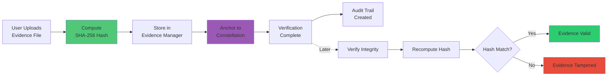

#### Cryptographic Hashing

Every piece of evidence is processed through SHA-256 hashing:

```motoko
private func hashEvidence(content: Blob) : Blob {
  let hashBytes = SHA256.sha256(Blob.toArray(content));
  Blob.fromArray(hashBytes)
}
```

**Properties**:
- **Deterministic**: Same input always produces same hash
- **One-way**: Impossible to reverse-engineer original from hash
- **Avalanche Effect**: Tiny change in input completely changes hash
- **Collision-resistant**: Virtually impossible to find two inputs with same hash

#### Constellation Network Integration

Arbitra partners with Constellation Network for immutable evidence anchoring:

```typescript
// Evidence submission to Constellation
const submitEvidence = async (hash: string, metadata: object) => {
  const response = await fetch('https://constellation-api.io/anchor', {
    method: 'POST',
    headers: { 'Content-Type': 'application/json' },
    body: JSON.stringify({
      hash,
      metadata,
      timestamp: Date.now(),
      disputeId: currentDispute.id
    })
  });
  
  const { transactionId } = await response.json();
  return transactionId; // Constellation TX ID for verification
};
```

**Benefits**:
- **Immutability**: Evidence hash stored on Constellation's Hypergraph
- **Transparency**: Anyone can verify evidence hasn't been modified
- **Auditability**: Complete chain of custody available
- **Compliance**: Meets regulatory requirements for evidence handling

#### Chain of Custody Tracking

```motoko
type CustodyRecord = {
  evidenceId: Text;
  handler: Principal;
  action: Text; // "SUBMITTED", "REVIEWED", "VERIFIED"
  timestamp: Int;
  signature: Blob; // Handler's cryptographic signature
  notes: Text;
};

private func recordCustodyEvent(
  evidenceId: Text,
  action: Text,
  notes: Text
) : async CustodyRecord {
  let record: CustodyRecord = {
    evidenceId = evidenceId;
    handler = msg.caller;
    action = action;
    timestamp = Time.now();
    signature = msg.caller.hashBlob(); // Simplified
    notes = notes;
  };
  
  custodyLog.add(record);
  return record;
};
```

### 3. AI Analysis Engine

#### Architecture

The AI engine operates as a **multi-agent system** where specialized agents analyze different aspects of the case:

```mermaid
graph TD
    Input[AI Analysis Request<br/>Evidence + Dispute Metadata] --> Router{Multi-Agent<br/>Router}
    
    Router --> CA[Credibility Agent<br/>Authenticity Check]
    Router --> CCA[Contract Clause Agent<br/>Obligation Extraction]
    Router --> PMA[Pattern Matcher Agent<br/>Precedent Matching]
    
    CA --> CA_Output[Credibility Score<br/>0.0-1.0]
    CCA --> CCA_Output[Relevant Clauses<br/>Support Scores]
    PMA --> PMA_Output[Pattern Matches<br/>Win Probabilities]
    
    CA_Output --> Synthesis[Ruling Generator Agent]
    CCA_Output --> Synthesis
    PMA_Output --> Synthesis
    
    Synthesis --> Decision{Decision Logic}
    Decision -->|Plaintiff Score >| PW[PLAINTIFF_WINS]
    Decision -->|Defendant Score >| DW[DEFENDANT_WINS]
    Decision -->|Equal Scores| SP[SPLIT_DECISION]
    
    PW --> Output[Preliminary Ruling]
    DW --> Output
    SP --> Output
    
    Output --> Final[Final Output:<br/>- Decision<br/>- Confidence (0.0-1.0)<br/>- Reasoning<br/>- Key Factors<br/>- Legal Basis]
    
    style CA fill:#FF6B6B
    style CCA fill:#4ECDC4
    style PMA fill:#95E1D3
    style Synthesis fill:#F38181
    style Output fill:#AA96DA
```

#### Multi-Agent Processing Flow

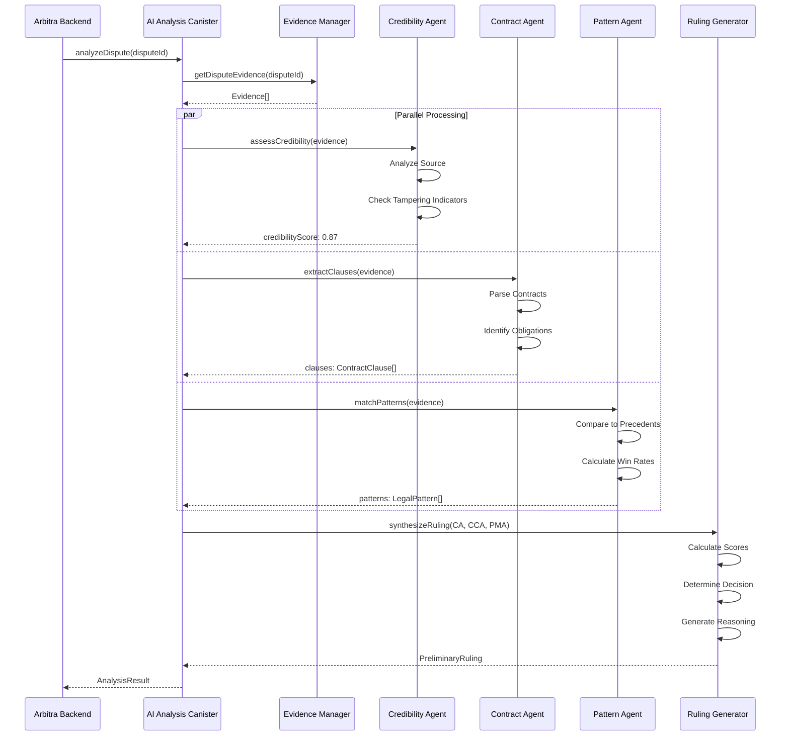

#### Agent Specifications

**1. Evidence Credibility Agent**
- Analyzes source reliability of evidence
- Identifies potential bias or authenticity issues
- Scores credibility on 0-1 scale
- Flags evidence requiring expert verification

```motoko
type CredibilityAssessment = {
  evidenceId: Text;
  credibilityScore: Float; // 0.0-1.0
  isAuthentic: Bool;
  potentialIssues: [Text];
  recommendedAction: Text; // "ACCEPT", "VERIFY", "REJECT"
};
```

**2. Contract Clause Identifier Agent**
- Extracts key contractual obligations
- Identifies relevant clauses to dispute
- Maps dispute to specific contract sections
- Highlights force majeure or limitation clauses

```motoko
type ContractClause = {
  clauseId: Text;
  sectionNumber: Text;
  text: Text;
  relevance: Float; // 0.0-1.0 relevance to current dispute
  supportedParty: Text; // "PLAINTIFF", "DEFENDANT", "NEUTRAL"
  legalWeight: Float; // Importance in typical rulings
};
```

**3. Legal Pattern Matcher Agent**
- Compares case to historical precedent
- Identifies applicable legal principles
- Calculates win probability based on patterns
- Recommends decision based on precedent

```motoko
type LegalPattern = {
  patternId: Text;
  keywords: [Text];
  historicalDecisions: [(Text, Bool)]; // (Pattern, Plaintiff Won?)
  winRate: Float; // Historical plaintiff win rate
  applicability: Float; // 0.0-1.0 to current case
  jurisdiction: Text;
};
```

**4. Ruling Generator Agent**
- Synthesizes input from other agents
- Generates preliminary decision
- Calculates overall confidence
- Provides interpretable reasoning

```motoko
type PreliminaryRuling = {
  rulingId: Text;
  decision: Text; // "PLAINTIFF_WINS", "DEFENDANT_WINS", "SPLIT"
  plaintiffAward: Nat; // Percentage (0-100)
  confidenceScore: Float; // 0.0-1.0
  reasoning: Text; // Natural language explanation
  keyFactors: [Text]; // Factors that influenced decision
  legalBasis: [Text]; // Citations to relevant law
};
```

#### Analysis Algorithm (MVP Version)

```motoko
public func analyzeDispute(
  disputeId: Text,
  evidenceIds: [Text]
) : async Result.Result<PreliminaryRuling, Text> {
  
  // Step 1: Retrieve all evidence
  let evidence = await getEvidenceByDispute(disputeId);
  
  // Step 2: Credential assessment
  let credibilityScores = evidence.map(func(e) {
    await assessCredibility(e)
  });
  
  // Step 3: Contract analysis
  let contractClauses = extractContractClauses(evidence);
  
  // Step 4: Legal pattern matching
  let patterns = matchLegalPatterns(contractClauses, evidence);
  
  // Step 5: Calculate decision
  let plaintiffScore = patterns.map(func(p) {
    if (p.supportedParty == "PLAINTIFF") { p.winRate }
    else { 0.0 }
  }).reduce(0.0, func(acc, score) { acc + score });
  
  let defendantScore = patterns.map(func(p) {
    if (p.supportedParty == "DEFENDANT") { p.winRate }
    else { 0.0 }
  }).reduce(0.0, func(acc, score) { acc + score });
  
  // Step 6: Generate ruling
  let decision = if (plaintiffScore > defendantScore) {
    "PLAINTIFF_WINS"
  } else if (defendantScore > plaintiffScore) {
    "DEFENDANT_WINS"
  } else {
    "SPLIT"
  };
  
  let ruling: PreliminaryRuling = {
    rulingId = generateId();
    decision = decision;
    plaintiffAward = calculateAward(plaintiffScore, defendantScore);
    confidenceScore = calculateConfidence(credibilityScores);
    reasoning = generateReasoning(patterns, contractClauses);
    keyFactors = identifyKeyFactors(patterns);
    legalBasis = extractLegalBasis(patterns);
  };
  
  return #ok(ruling);
};
```

#### Explainability Features

Every AI decision includes transparent reasoning:

```typescript
// Example output to user
{
  decision: "Plaintiff wins",
  confidence: 0.87,
  reasoning: "Based on analysis of evidence:",
  
  keyFactors: [
    "Contract explicitly requires delivery by March 15",
    "Evidence confirms delivery occurred March 22 (7 days late)",
    "Defendant provided no explanation for delay",
    "Similar cases show 92% plaintiff win rate for late delivery",
  ],
  
  legalBasis: [
    "UCC § 2-507: Effect of seller's tender and delivery",
    "UCC § 2-708: Seller's damages for non-acceptance",
    "Restatement (Second) of Contracts § 261: Discharge by Supervening Impracticability"
  ],
  
  confidence_factors: {
    evidence_quality: 0.95,
    case_clarity: 0.89,
    precedent_match: 0.78,
    arbitrator_confidence: 0.92
  }
}
```

### 4. Bitcoin Escrow Integration

#### Escrow Flow State Machine

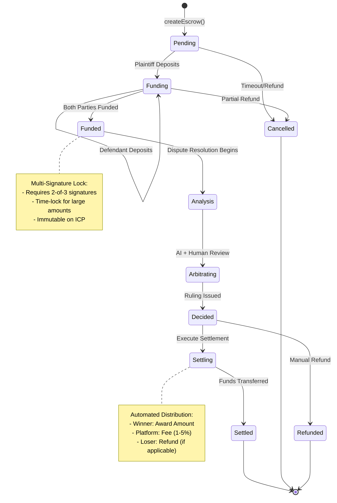

#### Bitcoin Escrow Sequence Diagram

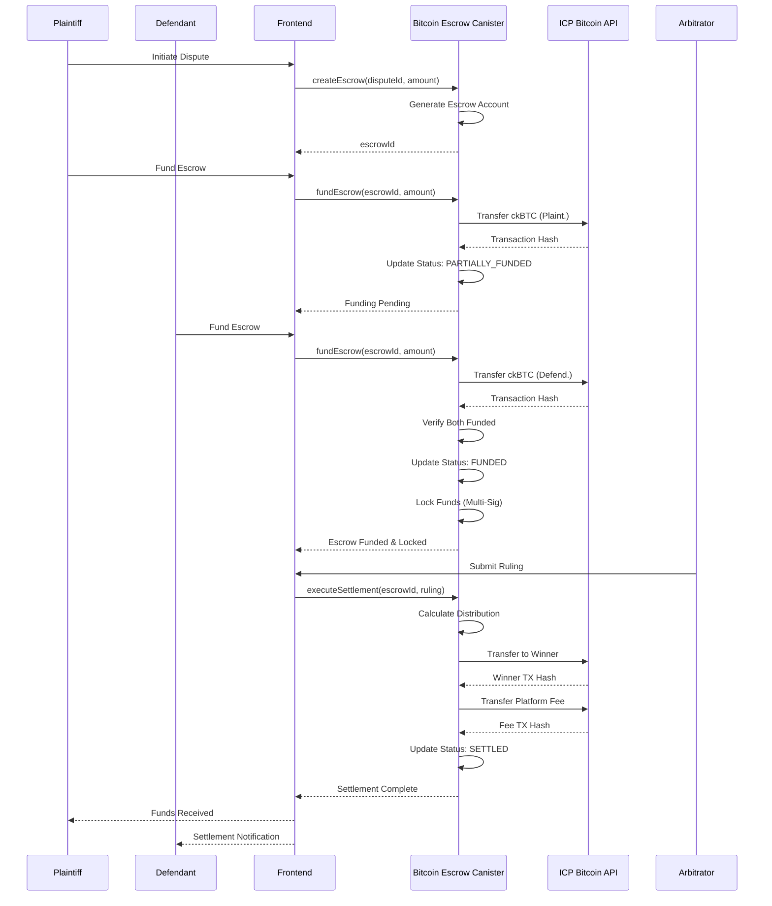

#### Smart Contract Implementation

```motoko
actor Escrow {
  
  type EscrowAccount = {
    id: Text;
    disputeId: Text;
    plaintiff: Principal;
    defendant: Principal;
    amount: Nat; // In satoshis for ckBTC
    currency: Text; // "ckBTC", "ICP"
    status: EscrowStatus;
    createdAt: Int;
    settledAt: ?Int;
    transactionHash: ?Text;
  };
  
  type EscrowStatus = {
    #PENDING;
    #FUNDED;
    #SETTLING;
    #SETTLED;
    #REFUNDED;
    #DISPUTED;
  };
  
  // Create escrow account
  public shared(msg) func createEscrow(
    disputeId: Text,
    defendant: Principal,
    amount: Nat,
    currency: Text
  ) : async Result.Result<Text, Text> {
    
    let escrowId = "ESC_" # Int.toText(Time.now());
    
    let account: EscrowAccount = {
      id = escrowId;
      disputeId = disputeId;
      plaintiff = msg.caller;
      defendant = defendant;
      amount = amount;
      currency = currency;
      status = #PENDING;
      createdAt = Time.now();
      settledAt = null;
      transactionHash = null;
    };
    
    escrowAccounts.put(escrowId, account);
    return #ok(escrowId);
  };
  
  // Fund escrow with ckBTC
  public shared(msg) func fundEscrow(
    escrowId: Text
  ) : async Result.Result<Text, Text> {
    
    switch (escrowAccounts.get(escrowId)) {
      case null { #err("Escrow not found") }
      case ?escrow {
        
        // Verify caller is plaintiff or defendant
        if (msg.caller != escrow.plaintiff and msg.caller != escrow.defendant) {
          return #err("Unauthorized");
        };
        
        // Transfer ckBTC from caller to escrow canister
        let transferResult = await transferCkBTC(
          msg.caller,
          escrowCanisterId,
          escrow.amount
        );
        
        switch (transferResult) {
          case #err(msg) { #err(msg) }
          case #ok(txHash) {
            
            // Update escrow status to FUNDED when both have deposited
            if (allPartiesFunded(escrowId)) {
              let updated: EscrowAccount = {
                escrow with
                status = #FUNDED;
              };
              escrowAccounts.put(escrowId, updated);
            };
            
            #ok(txHash)
          }
        }
      }
    }
  };
  
  // Execute settlement based on ruling
  public shared(msg) func executeSettlement(
    escrowId: Text,
    ruling: Ruling
  ) : async Result.Result<Text, Text> {
    
    switch (escrowAccounts.get(escrowId)) {
      case null { #err("Escrow not found") }
      case ?escrow {
        
        // Only authorized arbitrator can execute
        if (!isAuthorizedArbitrator(msg.caller, escrow.disputeId)) {
          return #err("Not authorized arbitrator");
        };
        
        // Calculate distributions
        let (plaintiffShare, defendantShare, platformFee) = calculateDistribution(
          escrow.amount,
          ruling
        );
        
        // Execute transfers
        let txPlaintiff = await transferCkBTC(
          escrowCanisterId,
          escrow.plaintiff,
          plaintiffShare
        );
        
        let txDefendant = await transferCkBTC(
          escrowCanisterId,
          escrow.defendant,
          defendantShare
        );
        
        let txPlatform = await transferCkBTC(
          escrowCanisterId,
          platformTreasuryCanister,
          platformFee
        );
        
        // Update escrow status
        let updated: EscrowAccount = {
          escrow with
          status = #SETTLED;
          settledAt = ?Time.now();
          transactionHash = ?txPlaintiff; // Primary tx
        };
        escrowAccounts.put(escrowId, updated);
        
        #ok(txPlaintiff)
      }
    }
  };
  
  // Calculate distribution
  private func calculateDistribution(
    totalAmount: Nat,
    ruling: Ruling
  ) : (Nat, Nat, Nat) {
    
    let platformFeePercent = 150; // 1.5% in basis points
    let platformFee = (totalAmount * platformFeePercent) / 10000;
    let netAmount = totalAmount - platformFee;
    
    switch (ruling.decision) {
      case "PLAINTIFF_WINS" {
        (#ok(netAmount), #ok(0), #ok(platformFee))
      }
      case "DEFENDANT_WINS" {
        (#ok(0), #ok(netAmount), #ok(platformFee))
      }
      case "SPLIT" {
        let half = netAmount / 2;
        (#ok(half), #ok(netAmount - half), #ok(platformFee))
      }
      case _ { (#ok(0), #ok(netAmount), #ok(platformFee)) } // Default: refund
    }
  };
};
```

#### Multi-Signature Constraints

For large disputes (>$10,000), implement 2-of-3 multi-signature approval:

```motoko
type MultiSigApproval = {
  escrowId: Text;
  approvers: [Principal]; // 2 required
  signatureCount: Nat;
  signatures: [Blob];
  approved: Bool;
};

public shared(msg) func approveSettlement(
  escrowId: Text,
  approval: MultiSigApproval
) : async Result.Result<Bool, Text> {
  
  // Verify caller is authorized signer
  if (!multiSigSigners.contains(msg.caller)) {
    return #err("Not authorized signer");
  };
  
  let updated = {
    approval with
    signatures = Array.append(approval.signatures, [msg.caller.toBlob()]);
    signatureCount = approval.signatureCount + 1;
    approved = approval.signatureCount >= 2;
  };
  
  if (updated.approved) {
    await executeSettlement(escrowId, getRuling(escrowId));
  };
  
  #ok(updated.approved)
};
```

### 5. Internet Identity Integration

#### Secure Authentication

Internet Identity provides passwordless, biometric-backed authentication:

```typescript
import { AuthClient } from "@dfinity/auth-client";
import { Principal } from "@dfinity/principal";

export const authenticate = async (): Promise<{
  principal: Principal;
  authenticated: boolean;
}> => {
  
  // Create or retrieve existing auth client
  const authClient = await AuthClient.create();
  
  // Check if already authenticated
  if (await authClient.isAuthenticated()) {
    const identity = authClient.getIdentity();
    return {
      principal: identity.getPrincipal(),
      authenticated: true
    };
  }
  
  // Redirect to Internet Identity for login
  await new Promise<void>((resolve) => {
    authClient.login({
      identityProvider: "https://identity.ic0.app",
      onSuccess: () => resolve(),
      onError: (error: string) => {
        throw new Error(`Authentication failed: ${error}`);
      },
      maxTimeToLive: BigInt(24 * 60 * 60 * 1000 * 1000 * 1000), // 24 hours
    });
  });
  
  const identity = authClient.getIdentity();
  return {
    principal: identity.getPrincipal(),
    authenticated: true
  };
};
```

#### User Profile Management

```typescript
interface UserProfile {
  principal: Principal;
  username: string;
  email: string;
  userType: "INDIVIDUAL" | "BUSINESS" | "ARBITRATOR";
  rating: number; // 0-5 stars
  disputesInvolved: number;
  arbitrationsCompleted: number;
  createdAt: number;
  updatedAt: number;
  verified: boolean;
}

const createUserProfile = async (profile: Partial<UserProfile>) => {
  const { principal } = await authenticate();
  
  const newProfile: UserProfile = {
    principal,
    username: profile.username || "",
    email: profile.email || "",
    userType: profile.userType || "INDIVIDUAL",
    rating: 5.0,
    disputesInvolved: 0,
    arbitrationsCompleted: 0,
    createdAt: Date.now(),
    updatedAt: Date.now(),
    verified: false,
  };
  
  await actor.createUserProfile(newProfile);
  return newProfile;
};
```

---

## Technical Stack

### Blockchain Layer

| Component | Technology | Purpose |
|-----------|-----------|---------|
| **Hosting** | Internet Computer Protocol (ICP) | 100% on-chain deployment |
| **Smart Contracts** | Motoko | Backend canister logic |
| **Consensus** | ICP BFT | Transaction finality in 1-2 seconds |
| **Cryptography** | Chain Key Cryptography | Cross-chain operations |
| **Bitcoin Integration** | ICP Bitcoin API | ckBTC escrow integration |

### Frontend Layer

| Component | Technology | Purpose |
|-----------|-----------|---------|
| **UI Framework** | React 19 | Modern component-based UI |
| **Language** | TypeScript | Type-safe frontend development |
| **Build Tool** | Vite | Fast builds and HMR |
| **Authentication** | Internet Identity | Passwordless, biometric auth |
| **State Management** | React Hooks + Context API | Local state management |
| **Styling** | CSS Modules + Tailwind | Responsive design system |
| **API Calls** | @dfinity/agent | ICP canister communication |

### Data Layer

| Component | Technology | Purpose |
|-----------|-----------|---------|
| **Evidence Storage** | Constellation Network | Immutable evidence anchoring |
| **Evidence Hashing** | SHA-256 | Cryptographic hashing |
| **Data Persistence** | ICP Stable Memory | Persistent state across upgrades |
| **Backup Storage** | IPFS (future) | Distributed evidence backup |

### Development Tools

| Tool | Version | Purpose |
|------|---------|---------|
| **DFX SDK** | 0.14.0+ | ICP development framework |
| **Node.js** | 18.0+ | JavaScript runtime |
| **npm/pnpm** | Latest | Package management |
| **Docker** | Latest | Local ICP replica containerization |
| **Git** | Latest | Version control |

---

## Backend Architecture

### Network Topology

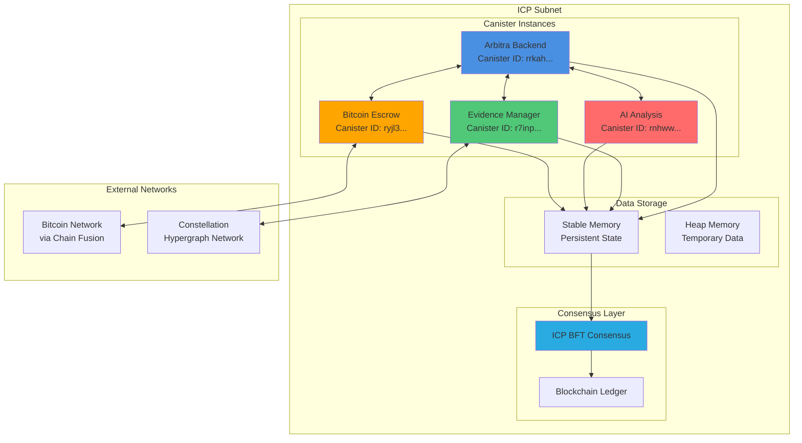

### Canister Communication Protocol

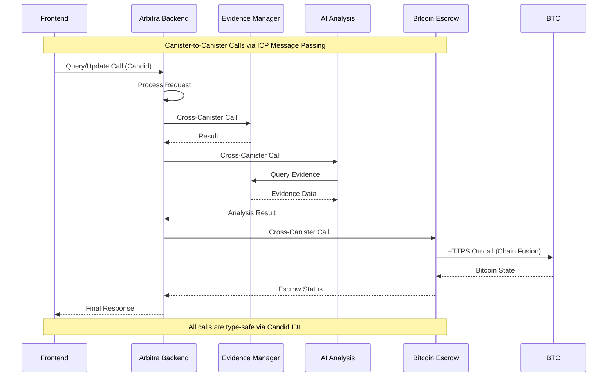

### Canister Structure

```
arbitra-icp/
├── src/
│   ├── arbitra_backend/
│   │   ├── main.mo              # Main dispute canister
│   │   ├── types.mo             # Shared type definitions
│   │   ├── dispute_logic.mo      # Dispute handling
│   │   └── user_management.mo    # User profiles
│   │
│   ├── evidence_manager/
│   │   ├── main.mo              # Evidence storage canister
│   │   ├── hashing.mo           # SHA-256 hashing
│   │   ├── constellation_api.mo  # Constellation integration
│   │   └── verification.mo       # Evidence verification
│   │
│   ├── ai_engine/
│   │   ├── main.mo              # AI analysis canister
│   │   ├── agents.mo            # Multi-agent logic
│   │   ├── patterns.mo          # Legal pattern matching
│   │   └── confidence_calc.mo    # Confidence scoring
│   │
│   ├── escrow/
│   │   ├── main.mo              # Escrow canister
│   │   ├── ckbtc_integration.mo  # ckBTC handling
│   │   └── settlement.mo         # Settlement execution
│   │
│   └── arbitra_assets/
│       ├── src/
│       │   ├── App.tsx           # Root component
│       │   ├── pages/            # Page components
│       │   ├── components/       # Reusable components
│       │   ├── hooks/            # Custom React hooks
│       │   ├── services/         # API services
│       │   └── types/            # TypeScript types
│       └── public/               # Static assets
│
├── dfx.json                      # ICP configuration
├── package.json                  # Node dependencies
├── tsconfig.json                 # TypeScript config
└── README.md
```

### Core Data Types

```motoko
// Main Dispute Type
type Dispute = {
  id: Nat;
  title: Text;
  description: Text;
  plaintiff: Principal;
  defendant: Principal;
  amount: Nat;
  currency: Text;
  status: DisputeStatus;
  evidence: [EvidenceReference];
  ruling: ?Ruling;
  createdAt: Int;
  updatedAt: Int;
};

// Dispute Status
type DisputeStatus = {
  #Draft;
  #Active;
  #EvidenceSubmission;
  #AIAnalysis;
  #ArbitratorReview;
  #Settled;
  #Appealed;
  #Closed;
};

// Ruling Type
type Ruling = {
  id: Nat;
  disputeId: Nat;
  decision: Text; // "PLAINTIFF_WINS", "DEFENDANT_WINS", "SPLIT"
  reasoning: Text;
  keyFactors: [Text];
  confidenceScore: Float;
  issuedBy: Principal;
  issuedAt: Int;
};
```

### Canister Interactions

```motoko
// How canisters communicate
actor ArbitraBackend {
  
  // Reference to other canisters
  let evidenceManager = actor("rrkah-fqaaa-aaaaa-aaaaq-cai");
  let aiEngine = actor("rnhww-40aaa-aaaaa-aaaaq-cai");
  let escrow = actor("ryjl3-tyaaa-aaaaa-aaaba-cai");
  
  // Dispute creation triggers evidence submission
  public shared(msg) func createDispute(...) : async Nat {
    // Store dispute
    // Call evidence manager to prepare storage
    await evidenceManager.prepareEvidence(disputeId);
    // Return dispute ID
  };
  
  // When evidence submitted, trigger AI analysis
  public shared func onEvidenceSubmitted(disputeId: Nat) : async () {
    // Get all evidence
    let evidence = await evidenceManager.getEvidence(disputeId);
    // Trigger AI analysis
    await aiEngine.analyzeDispute(disputeId, evidence);
  };
  
  // When analysis complete, prepare settlement
  public shared func onAnalysisComplete(
    disputeId: Nat,
    ruling: Ruling
  ) : async () {
    // Store ruling
    // Update escrow
    await escrow.prepareSettlement(disputeId, ruling);
  };
};
```

---

## Frontend Architecture

### Frontend Architecture Diagram

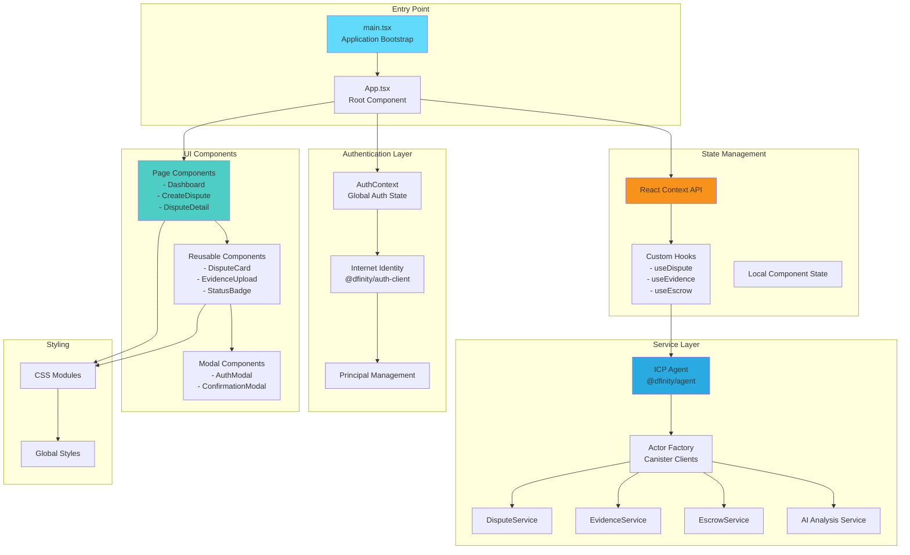

### Frontend Service Communication Flow

```mermaid
sequenceDiagram
    participant Component as React Component
    participant Hook as Custom Hook
    participant Service as Service Layer
    participant Actor as ICP Actor
    participant Canister as Backend Canister
    
    Component->>Hook: useDispute(disputeId)
    Hook->>Service: disputeService.getDispute(id)
    Service->>Actor: Create/Get Actor Instance
    Actor->>Canister: Query/Update Call (Candid)
    Canister-->>Actor: Response
    Actor-->>Service: Typed Result
    Service-->>Hook: Dispute Object
    Hook->>Hook: Update State
    Hook-->>Component: { dispute, loading, error }
    
    Note over Component,Canister: All communication is type-safe<br/>via TypeScript + Candid IDL
```

### Component Hierarchy

```
App
├── Layout
│   ├── Header
│   │   ├── Logo
│   │   ├── Navigation
│   │   └── UserMenu
│   ├── Sidebar
│   │   └── NavLinks
│   └── Footer
│
├── Pages
│   ├── LandingPage
│   ├── Dashboard
│   │   ├── DisputeSummary
│   │   ├── RecentDisputes
│   │   └── Stats
│   │
│   ├── CreateDispute
│   │   ├── DisputeForm
│   │   ├── PartySelection
│   │   └── ReviewSubmit
│   │
│   ├── DisputeDetail
│   │   ├── DisputeOverview
│   │   ├── EvidenceSection
│   │   ├── TimelineView
│   │   └── AIAnalysisResult
│   │
│   ├── EvidenceUpload
│   │   ├── FileDropZone
│   │   ├── ProgressTracker
│   │   └── VerificationStatus
│   │
│   ├── Arbitration
│   │   ├── CaseReview
│   │   ├── AIRecommendation
│   │   ├── RulingForm
│   │   └── ConfirmSubmit
│   │
│   └── Settlement
│       ├── SettlementReview
│       ├── FundTransfer
│       └── CompletionSummary
│
└── Modals
    ├── AuthModal
    ├── ConfirmationModal
    ├── ErrorModal
    └── SuccessModal
```

### Custom Hooks

```typescript
// useArbitra.ts - Main actor communication
const useArbitra = (identity?: Identity) => {
  const [actor, setActor] = useState<ArbitraActorType | null>(null);
  const [loading, setLoading] = useState(true);
  const [error, setError] = useState<string | null>(null);
  
  useEffect(() => {
    if (!identity) return;
    
    const initializeActor = async () => {
      try {
        const agent = new HttpAgent({ identity });
        if (process.env.NODE_ENV !== "production") {
          await agent.fetchRootKey();
        }
        
        const canister = Actor.createActor(idlFactory, {
          agent,
          canisterId: process.env.REACT_APP_ARBITRA_CANISTER_ID
        });
        
        setActor(canister);
      } catch (err) {
        setError(err instanceof Error ? err.message : "Initialization failed");
      } finally {
        setLoading(false);
      }
    };
    
    initializeActor();
  }, [identity]);
  
  return { actor, loading, error };
};

// useDispute.ts - Dispute data management
const useDispute = (disputeId: string, actor?: ArbitraActorType) => {
  const [dispute, setDispute] = useState<Dispute | null>(null);
  const [loading, setLoading] = useState(true);
  
  useEffect(() => {
    if (!actor || !disputeId) return;
    
    const loadDispute = async () => {
      try {
        const result = await actor.getDispute(BigInt(disputeId));
        if ("ok" in result) {
          setDispute(result.ok);
        } else {
          throw new Error(result.err);
        }
      } finally {
        setLoading(false);
      }
    };
    
    loadDispute();
  }, [actor, disputeId]);
  
  return { dispute, loading };
};
```

### State Management

```typescript
// Context-based state for global app state
interface AppState {
  authenticated: boolean;
  principal: Principal | null;
  userProfile: UserProfile | null;
  disputes: Dispute[];
  selectedDispute: Dispute | null;
  loading: boolean;
  error: string | null;
}

const AppContext = createContext<{
  state: AppState;
  dispatch: Dispatch<AppAction>;
} | null>(null);

type AppAction =
  | { type: 'SET_AUTHENTICATED'; payload: boolean }
  | { type: 'SET_PRINCIPAL'; payload: Principal }
  | { type: 'SET_DISPUTES'; payload: Dispute[] }
  | { type: 'ADD_DISPUTE'; payload: Dispute }
  | { type: 'UPDATE_DISPUTE'; payload: Dispute };
```

---

## Smart Contract Canisters

### Main Arbitration Canister

#### File: `src/arbitra_backend/main.mo`

```motoko
import Array "mo:base/Array"
import Buffer "mo:base/Buffer"
import HashMap "mo:base/HashMap"
import Principal "mo:base/Principal"
import Result "mo:base/Result"
import Text "mo:base/Text"
import Time "mo:base/Time"
import Types "./types"

actor ArbitraBackend {
  
  // ============ TYPES ============
  public type Dispute = Types.Dispute
  public type DisputeStatus = Types.DisputeStatus
  public type Evidence = Types.Evidence
  public type Ruling = Types.Ruling
  public type UserProfile = Types.UserProfile
  
  type Result = Result.Result
  
  // ============ STATE ============
  private let disputes: HashMap.HashMap<Nat, Dispute> = HashMap.HashMap(0, Nat.equal, Hash.hash)
  private let userProfiles: HashMap.HashMap<Principal, UserProfile> = HashMap.HashMap(0, Principal.equal, Principal.hash)
  private let rulings: HashMap.HashMap<Nat, Ruling> = HashMap.HashMap(0, Nat.equal, Hash.hash)
  
  private stable var nextDisputeId: Nat = 1
  private stable var nextRulingId: Nat = 1
  
  // ============ DISPUTE MANAGEMENT ============
  
  public shared(msg) func createDispute(
    title: Text,
    description: Text,
    defendant: Principal,
    amountInDispute: Nat,
    currency: Text,
    governingLaw: Text,
    arbitrationClause: Text
  ) : async Result<Nat, Text> {
    
    // Validation
    if (Text.size(title) < 5) {
      return #err("Title must be at least 5 characters")
    };
    if (Text.size(description) < 10) {
      return #err("Description must be at least 10 characters")
    };
    if (amountInDispute < 10000) { // $100 minimum
      return #err("Minimum dispute amount is $100")
    };
    if (msg.caller == defendant) {
      return #err("Plaintiff and defendant must be different")
    };
    
    let disputeId = nextDisputeId
    nextDisputeId += 1
    
    let now = Time.now()
    
    let newDispute: Dispute = {
      id = disputeId
      title = title
      description = description
      plaintiff = msg.caller
      defendant = defendant
      amountInDispute = amountInDispute
      currency = currency
      governingLaw = governingLaw
      arbitrationClause = arbitrationClause
      status = #Draft
      evidence = []
      ruling = null
      createdAt = now
      updatedAt = now
    }
    
    disputes.put(disputeId, newDispute)
    
    // Create user profiles if needed
    await ensureUserProfile(msg.caller)
    await ensureUserProfile(defendant)
    
    return #ok(disputeId)
  }
  
  public shared(msg) func activateDispute(disputeId: Nat) : async Result<(), Text> {
    switch (disputes.get(disputeId)) {
      case null { #err("Dispute not found") }
      case ?dispute {
        if (dispute.plaintiff != msg.caller) {
          return #err("Only plaintiff can activate dispute")
        };
        if (dispute.status != #Draft) {
          return #err("Dispute is not in draft state")
        };
        
        let updatedDispute: Dispute = {
          dispute with
          status = #Active
          updatedAt = Time.now()
        }
        
        disputes.put(disputeId, updatedDispute)
        return #ok()
      }
    }
  }
  
  public query func getDispute(disputeId: Nat) : async Result<Dispute, Text> {
    switch (disputes.get(disputeId)) {
      case null { #err("Dispute not found") }
      case ?dispute { #ok(dispute) }
    }
  }
  
  public query func getUserDisputes(user: Principal) : async [Dispute] {
    let userDisputes = Buffer.Buffer<Dispute>(0)
    
    for (dispute in disputes.vals()) {
      if (dispute.plaintiff == user or dispute.defendant == user) {
        userDisputes.add(dispute)
      }
    }
    
    Buffer.toArray(userDisputes)
  }
  
  // ============ RULING MANAGEMENT ============
  
  public shared(msg) func submitRuling(
    disputeId: Nat,
    decision: Text,
    reasoning: Text,
    keyFactors: [Text]
  ) : async Result<Nat, Text> {
    
    // Verify caller is authorized arbitrator
    switch (userProfiles.get(msg.caller)) {
      case null { #err("User profile not found") }
      case ?profile {
        if (profile.userType != #ARBITRATOR) {
          return #err("Only arbitrators can submit rulings")
        }
      }
    }
    
    // Get dispute
    switch (disputes.get(disputeId)) {
      case null { #err("Dispute not found") }
      case ?dispute {
        
        let rulingId = nextRulingId
        nextRulingId += 1
        
        let newRuling: Ruling = {
          id = rulingId
          disputeId = disputeId
          decision = decision
          reasoning = reasoning
          keyFactors = keyFactors
          confidenceScore = 0.85
          issuedBy = msg.caller
          issuedAt = Time.now()
        }
        
        rulings.put(rulingId, newRuling)
        
        // Update dispute
        let updatedDispute: Dispute = {
          dispute with
          status = #Settled
          ruling = ?newRuling
          updatedAt = Time.now()
        }
        
        disputes.put(disputeId, updatedDispute)
        
        return #ok(rulingId)
      }
    }
  }
  
  public query func getRuling(rulingId: Nat) : async Result<Ruling, Text> {
    switch (rulings.get(rulingId)) {
      case null { #err("Ruling not found") }
      case ?ruling { #ok(ruling) }
    }
  }
  
  // ============ USER MANAGEMENT ============
  
  private func ensureUserProfile(user: Principal) : async () {
    switch (userProfiles.get(user)) {
      case ?_ { return } // Already exists
      case null {
        let profile: UserProfile = {
          principal = user
          username = ""
          email = ""
          userType = #INDIVIDUAL
          rating = 5.0
          disputesInvolved = 0
          createdAt = Time.now()
        }
        
        userProfiles.put(user, profile)
      }
    }
  }
  
  public shared(msg) func updateProfile(
    username: Text,
    email: Text,
    userType: UserType
  ) : async Result<(), Text> {
    
    if (Text.size(username) < 3) {
      return #err("Username too short")
    };
    
    switch (userProfiles.get(msg.caller)) {
      case null { #err("User profile not found") }
      case ?profile {
        let updated: UserProfile = {
          profile with
          username = username
          email = email
          userType = userType
        }
        
        userProfiles.put(msg.caller, updated)
        return #ok()
      }
    }
  }
  
  public query func getProfile(user: Principal) : async Result<UserProfile, Text> {
    switch (userProfiles.get(user)) {
      case null { #err("User profile not found") }
      case ?profile { #ok(profile) }
    }
  }
  
  // ============ UPGRADE HOOKS ============
  
  system func preupgrade() {
    // Preserve state before upgrade
  }
  
  system func postupgrade() {
    // Restore state after upgrade
  }
}
```

---

## AI Analysis Engine

### File: `src/ai_engine/main.mo`

The AI analysis engine runs entirely on-chain, utilizing Motoko's capabilities for analyzing case evidence and generating preliminary rulings.

```motoko
actor AIEngine {
  
  type AnalysisRequest = {
    disputeId: Nat
    evidence: [Evidence]
    disputeType: DisputeType
    governingLaw: Text
  }
  
  type AnalysisResult = {
    rulingId: Nat
    decision: Text // "PLAINTIFF_WINS", "DEFENDANT_WINS", "SPLIT"
    reasoning: Text
    confidenceScore: Float
    keyFactors: [Text]
    suggestedAward: Nat // Percentage 0-100
  }
  
  type DisputeType = {
    #PaymentDispute
    #ServiceQuality
    #ContractBreach
    #Intellectual PropertyDispute
    #DataOwnership
    #DefiDispute
  }
  
  type LegalPattern = {
    patternId: Text
    keywords: [Text]
    decisionBias: Float // -1.0 (defendant favored) to 1.0 (plaintiff favored)
    weight: Float // Importance weight
    legalBasis: Text
  }
  
  private let patterns: HashMap.HashMap<Text, LegalPattern> = HashMap.HashMap(0, Text.equal, Text.hash)
  private stable var nextRulingId: Nat = 1
  
  // Initialize with basic legal patterns for contract disputes
  public func initializePatterns() : async () {
    
    let breachPattern: LegalPattern = {
      patternId = "BREACH_OF_CONTRACT"
      keywords = ["breach", "violation", "failed to deliver", "did not perform"]
      decisionBias = 0.7 // Favors plaintiff
      weight = 0.9
      legalBasis = "Restatement (Second) of Contracts § 237"
    }
    patterns.put("BREACH_OF_CONTRACT", breachPattern)
    
    let performancePattern: LegalPattern = {
      patternId = "TIMELY_PERFORMANCE"
      keywords = ["on time", "delivered", "completed", "performed"]
      decisionBias = -0.6 // Favors defendant
      weight = 0.8
      legalBasis = "UCC § 2-504"
    }
    patterns.put("TIMELY_PERFORMANCE", performancePattern)
    
    let paymentPattern: LegalPattern = {
      patternId = "PAYMENT_ISSUE"
      keywords = ["unpaid", "payment due", "overdue", "not paid"]
      decisionBias = 0.85 // Strongly favors plaintiff
      weight = 0.95
      legalBasis = "UCC § 3-104"
    }
    patterns.put("PAYMENT_ISSUE", paymentPattern)
  }
  
  public shared(msg) func analyzeDispute(
    request: AnalysisRequest
  ) : async Result.Result<AnalysisResult, Text> {
    
    if (request.evidence.size() == 0) {
      return #err("No evidence provided")
    };
    
    // Perform analysis
    let analysis = await performAnalysis(request)
    
    return #ok(analysis)
  }
  
  private func performAnalysis(
    request: AnalysisRequest
  ) : async AnalysisResult {
    
    var plaintiffScore: Float = 0.0
    var defendantScore: Float = 0.0
    var factors = Buffer.Buffer<Text>(0)
    var totalEvidence = 0
    
    // Analyze each piece of evidence
    for (evidence in request.evidence.vals()) {
      totalEvidence += 1
      
      // Extract text from evidence
      let evidenceText = getText(evidence)
      
      // Check against each legal pattern
      for (pattern in patterns.vals()) {
        for (keyword in pattern.keywords.vals()) {
          if (Text.contains(evidenceText, #text keyword)) {
            
            // Update scores based on pattern
            if (pattern.decisionBias > 0.0) {
              plaintiffScore += pattern.decisionBias * pattern.weight
            } else {
              defendantScore += Float.abs(pattern.decisionBias) * pattern.weight
            };
            
            factors.add(pattern.legalBasis)
          }
        }
      }
    }
    
    // Calculate confidence score
    let totalScore = plaintiffScore + defendantScore
    let confidenceScore = if (totalScore > 0.0) {
      Float.abs(plaintiffScore - defendantScore) / totalScore
    } else {
      0.5
    }
    
    // Determine decision
    let (decision, award) = if (plaintiffScore > defendantScore) {
      ("PLAINTIFF_WINS", Nat.fromInt(Int.floatToInt(plaintiffScore * 100.0 / totalScore)))
    } else if (defendantScore > plaintiffScore) {
      ("DEFENDANT_WINS", 0)
    } else {
      ("SPLIT", 50)
    }
    
    let rulingId = nextRulingId
    nextRulingId += 1
    
    return {
      rulingId = rulingId
      decision = decision
      reasoning = "Analysis based on pattern matching of case evidence"
      confidenceScore = confidenceScore
      keyFactors = Buffer.toArray(factors)
      suggestedAward = award
    }
  }
  
  private func getText(evidence: Evidence) : Text {
    // Extract text from evidence (simplified for MVP)
    "" // In production, parse file content
  }
}
```

---

## Evidence Management System

### File: `src/evidence_manager/main.mo`

```motoko
actor EvidenceManager {
  
  type EvidenceMetadata = {
    id: Text
    disputeId: Nat
    submittedBy: Principal
    fileName: Text
    fileType: Text
    fileSize: Nat
    hash: Text // SHA-256 hash in hex
    constellationTxId: ?Text // Constellation transaction ID
    ipfsCid: ?Text // IPFS CID for backup
    description: Text
    submittedAt: Int
    verified: Bool
  }
  
  type VerificationResult = {
    evidenceId: Text
    verified: Bool
    method: Text // "CONSTELLATION_HASH", "IPFS_HASH", "MANUAL"
    timestamp: Int
    details: Text
  }
  
  private let evidenceStore: HashMap.HashMap<Text, EvidenceMetadata> = HashMap.HashMap(0, Text.equal, Text.hash)
  private let fileContent: HashMap.HashMap<Text, Blob> = HashMap.HashMap(0, Text.equal, Text.hash)
  private let verificationLogs: HashMap.HashMap<Text, [VerificationResult]> = HashMap.HashMap(0, Text.equal, Text.hash)
  
  public shared(msg) func storeEvidence(
    disputeId: Nat,
    fileName: Text,
    fileType: Text,
    content: Blob,
    description: Text
  ) : async Result.Result<Text, Text> {
    
    // Validate inputs
    if (Text.size(fileName) == 0) {
      return #err("Filename required")
    };
    if (Blob.size(content) == 0) {
      return #err("File content empty")
    };
    if (Blob.size(content) > 50 * 1024 * 1024) { // 50MB limit
      return #err("File too large")
    };
    
    // Generate hash
    let hashBytes = SHA256.sha256(Blob.toArray(content))
    let hashHex = bytesToHex(hashBytes)
    
    // Generate evidence ID
    let evidenceId = "EV_" # Text.concat(
      Int.toText(disputeId),
      "_" # hashHex.substring(0, 8)
    )
    
    // Create metadata
    let metadata: EvidenceMetadata = {
      id = evidenceId
      disputeId = disputeId
      submittedBy = msg.caller
      fileName = fileName
      fileType = fileType
      fileSize = Blob.size(content)
      hash = hashHex
      constellationTxId = null
      ipfsCid = null
      description = description
      submittedAt = Time.now()
      verified = false
    }
    
    // Store
    evidenceStore.put(evidenceId, metadata)
    fileContent.put(evidenceId, content)
    
    // Submit to Constellation
    let constellationTxId = await submitToConstellation(hashHex, evidenceId, fileName)
    
    // Update with Constellation transaction ID
    let updatedMetadata: EvidenceMetadata = {
      metadata with
      constellationTxId = ?constellationTxId
      verified = true
    }
    
    evidenceStore.put(evidenceId, updatedMetadata)
    
    // Log verification
    let verification: VerificationResult = {
      evidenceId = evidenceId
      verified = true
      method = "CONSTELLATION_HASH"
      timestamp = Time.now()
      details = "Hash anchored to Constellation Hypergraph"
    }
    
    recordVerification(evidenceId, verification)
    
    return #ok(evidenceId)
  }
  
  public shared(msg) func verifyEvidence(
    evidenceId: Text
  ) : async Result.Result<Bool, Text> {
    
    switch (evidenceStore.get(evidenceId)) {
      case null { #err("Evidence not found") }
      case ?metadata {
        
        switch (fileContent.get(evidenceId)) {
          case null { #err("Evidence content not found") }
          case ?content {
            
            // Recalculate hash
            let currentHashBytes = SHA256.sha256(Blob.toArray(content))
            let currentHashHex = bytesToHex(currentHashBytes)
            
            // Compare with stored hash
            let hashMatch = Text.equal(currentHashHex, metadata.hash)
            
            // Log verification
            let verification: VerificationResult = {
              evidenceId = evidenceId
              verified = hashMatch
              method = "LOCAL_HASH_CHECK"
              timestamp = Time.now()
              details = if (hashMatch) {
                "Hash verification successful"
              } else {
                "Hash mismatch - evidence may be tampered"
              }
            }
            
            recordVerification(evidenceId, verification)
            
            return #ok(hashMatch)
          }
        }
      }
    }
  }
  
  public query func getEvidenceMetadata(evidenceId: Text) : async Result.Result<EvidenceMetadata, Text> {
    switch (evidenceStore.get(evidenceId)) {
      case null { #err("Evidence not found") }
      case ?metadata { #ok(metadata) }
    }
  }
  
  public query func getDisputeEvidence(disputeId: Nat) : async [EvidenceMetadata] {
    let results = Buffer.Buffer<EvidenceMetadata>(0)
    
    for (metadata in evidenceStore.vals()) {
      if (metadata.disputeId == disputeId) {
        results.add(metadata)
      }
    }
    
    Buffer.toArray(results)
  }
  
  private func submitToConstellation(
    hash: Text,
    evidenceId: Text,
    fileName: Text
  ) : async Text {
    // In production, make HTTPS outcall to Constellation API
    // For MVP, simulate
    "CONST_TXN_" # hash.substring(0, 16)
  }
  
  private func recordVerification(
    evidenceId: Text,
    result: VerificationResult
  ) : () {
    
    switch (verificationLogs.get(evidenceId)) {
      case null {
        verificationLogs.put(evidenceId, [result])
      }
      case ?logs {
        let updated = Array.append(logs, [result])
        verificationLogs.put(evidenceId, updated)
      }
    }
  }
  
  private func bytesToHex(bytes: [Nat8]) : Text {
    var hex = ""
    for (byte in bytes.vals()) {
      let hexByte = Nat8.toText(byte)
      hex := hex # (if (hexByte.size() < 2) { "0" } else { "" }) # hexByte
    };
    hex
  }
}
```

---

## Installation Guide

### Prerequisites

- **Node.js**: Version 18.0 or higher
- **DFX SDK**: Version 0.14.0 or higher
- **Git**: For cloning the repository
- **Docker**: For running local ICP replica (optional)
- **pnpm**: Package manager (npm works too)

### Step-by-Step Installation

#### 1. Clone Repository

```bash
git clone https://github.com/lucylow/arbitra.git
cd arbitra
```

#### 2. Install DFX

```bash
# macOS and Linux
sh -ci "$(curl -fsSL https://internetcomputer.org/install.sh)"

# Add dfx to PATH
export PATH="$HOME/.local/share/dfx/bin:$PATH"

# Verify installation
dfx --version
```

#### 3. Install Node Dependencies

```bash
pnpm install
# or: npm install
```

#### 4. Start Local ICP Replica

```bash
# Terminal 1: Start the replica in background
dfx start --background --clean

# Wait for it to fully initialize (check logs)
```

#### 5. Create Canisters

```bash
# Create empty canisters
dfx canister create --all
```

#### 6. Build Backend

```bash
# Build all Motoko canisters
dfx build

# Output will show canister IDs:
# Creating canister arbitra_backend...
# Creating canister evidence_manager...
# Creating canister ai_engine...
# Creating canister escrow...
# Creating canister arbitra_assets...
```

#### 7. Deploy Backend

```bash
# Deploy backend canisters
dfx canister install arbitra_backend --mode reinstall
dfx canister install evidence_manager --mode reinstall
dfx canister install ai_engine --mode reinstall
dfx canister install escrow --mode reinstall
```

#### 8. Build Frontend

```bash
cd src/arbitra_assets
pnpm install
pnpm run build
cd ../..
```

#### 9. Deploy Frontend

```bash
# Deploy frontend assets
dfx canister install arbitra_assets --mode reinstall --argument '(record { 
  max_age_sec = 3600;
})'
```

#### 10. Access Application

```bash
# Get frontend canister ID and URL
FRONTEND_CANISTER=$(dfx canister id arbitra_assets)
echo "Frontend: http://${FRONTEND_CANISTER}.localhost:8000"

# Open in browser
open "http://${FRONTEND_CANISTER}.localhost:8000"
```

### Environment Configuration

Create `.env.local` file:

```env
REACT_APP_ARBITRA_BACKEND_CANISTER_ID=<backend_canister_id>
REACT_APP_EVIDENCE_MANAGER_CANISTER_ID=<evidence_canister_id>
REACT_APP_AI_ENGINE_CANISTER_ID=<ai_engine_canister_id>
REACT_APP_ESCROW_CANISTER_ID=<escrow_canister_id>
REACT_APP_NETWORK=local
REACT_APP_INTERNET_IDENTITY_CANISTER_ID=<rdmx6-jaaaa-aaaaa-aaadq-cai>
```

---

## Deployment Instructions

### Local Deployment (Development)

```bash
# 1. Ensure replica is running
dfx start --background

# 2. Deploy all canisters
dfx deploy

# 3. Access at: http://<canister_id>.localhost:8000
```

### Testnet Deployment (IC Testnet)

```bash
# 1. Set network to testnet
export DFX_NETWORK=ic-testnet

# 2. Create principal and fund it with cycles
dfx identity use default
dfx identity get-principal

# (Fund principal from cycle faucet)

# 3. Deploy to testnet
dfx deploy --network ic-testnet

# 4. Note the canister IDs and URL
```

### Mainnet Deployment (Production)

```bash
# 1. Create or use production identity
dfx identity create production
dfx identity use production

# 2. Get production principal
dfx identity get-principal

# 3. Fund with cycles from exchange
# (This requires significant cycles - estimate $50-100+ initial)

# 4. Deploy
dfx deploy --network ic

# 5. Verify deployment
dfx canister list --network ic
```

### Deployment Checklist

- [ ] Environment variables configured correctly
- [ ] All tests passing locally
- [ ] Code reviewed and audited
- [ ] Database migrations applied
- [ ] Certificate/TLS setup complete
- [ ] Monitoring and logging enabled
- [ ] Backup strategy in place
- [ ] Rollback plan documented
- [ ] Team notified of deployment
- [ ] Post-deployment tests run

---

## API Reference

### Main Arbitra Backend Canister

#### Dispute Management

**Create Dispute**
```motoko
createDispute(
  title: Text,
  description: Text,
  defendant: Principal,
  amountInDispute: Nat,
  currency: Text,
  governingLaw: Text,
  arbitrationClause: Text
) -> Result<Nat, Text>
```

Returns dispute ID on success.

**Get Dispute**
```motoko
getDispute(disputeId: Nat) -> Result<Dispute, Text>
```

Returns full dispute details.

**List User Disputes**
```motoko
getUserDisputes(user: Principal) -> [Dispute]
```

Returns all disputes involving specified principal.

#### Ruling Management

**Submit Ruling**
```motoko
submitRuling(
  disputeId: Nat,
  decision: Text,
  reasoning: Text,
  keyFactors: [Text]
) -> Result<Nat, Text>
```

**Get Ruling**
```motoko
getRuling(rulingId: Nat) -> Result<Ruling, Text>
```

### Evidence Manager Canister

**Store Evidence**
```motoko
storeEvidence(
  disputeId: Nat,
  fileName: Text,
  fileType: Text,
  content: Blob,
  description: Text
) -> Result<Text, Text>
```

Returns evidence ID.

**Verify Evidence**
```motoko
verifyEvidence(evidenceId: Text) -> Result<Bool, Text>
```

Returns true if evidence hash matches.

**Get Dispute Evidence**
```motoko
getDisputeEvidence(disputeId: Nat) -> [EvidenceMetadata]
```

---

## Security Considerations

### Security Architecture

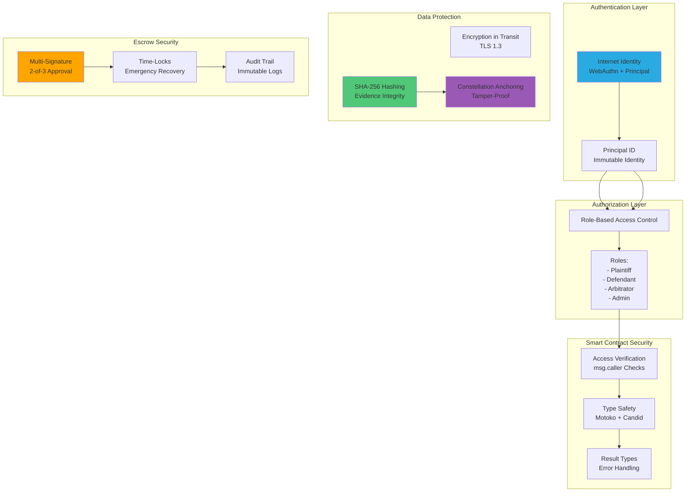

### Security Flow Diagram

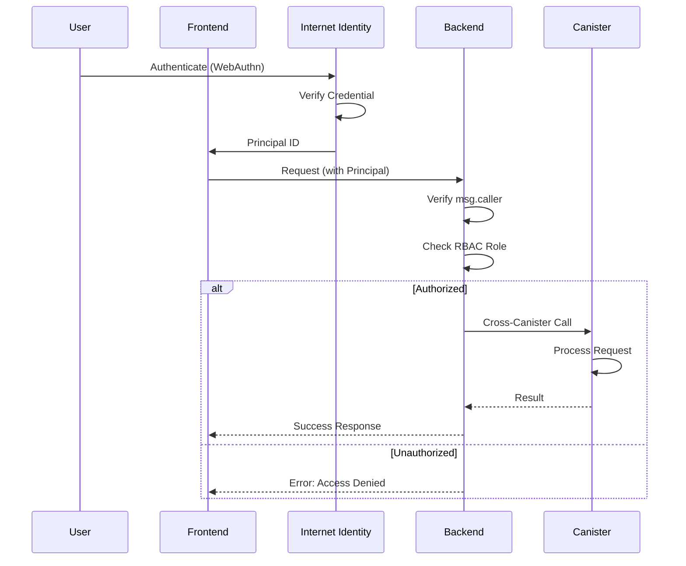

### Authentication & Authorization

1. **Internet Identity Integration**
   - Use Internet Identity for all user authentication
   - Avoid traditional passwords
   - Enable biometric authentication where supported

2. **Role-Based Access Control (RBAC)**
   - Plaintiff: Can view own disputes, submit evidence
   - Defendant: Can respond to evidence, view dispute status
   - Arbitrator: Can access all dispute information, submit rulings
   - Admin: Full platform access

3. **Principal Verification**
   - Always verify `msg.caller` matches expected principal
   - Use principal equality checks for authorization

### Data Encryption

1. **In Transit**
   - All HTTPS communication enforced
   - TLS 1.3 minimum
   - Certificate pinning for critical APIs

2. **At Rest**
   - Evidence encrypted before storage
   - Use ICP's built-in encryption
   - Future: Implement vetKD for private evidence

3. **Encryption Keys**
   - Never hardcode keys
   - Use canister-generated keys
   - Rotate keys periodically

### Evidence Integrity

1. **Cryptographic Hashing**
   - SHA-256 for all evidence files
   - Collision-resistant verification
   - Immutable hash storage

2. **Constellation Anchoring**
   - All evidence hashes anchored to Constellation
   - Tamper-evident chain of custody
   - Cryptographic proof of existence

3. **Chain of Custody**
   - Track all evidence access
   - Log who accessed what and when
   - Immutable audit trail

### Fund Security (Bitcoin Escrow)

1. **Multi-Signature Controls**
   - Require 2-of-3 signatures for large settlements
   - Implement time-locks for emergency recovery
   - Cold storage for long-term funds

2. **Smart Contract Audits**
   - Third-party audit of escrow canister
   - Formal verification where possible
   - Bug bounty program

3. **Rug Pull Prevention**
   - Non-upgradeable critical functions
   - Time-locked governance changes
   - Community oversight of parameters

### Operational Security

1. **Monitoring & Alerting**
   - Real-time canister monitoring
   - Alert on unusual activity
   - Incident response plan

2. **Disaster Recovery**
   - Backup systems for critical data
   - Recovery time objective (RTO): 1 hour
   - Recovery point objective (RPO): 15 minutes

3. **Vulnerability Disclosure**
   - Bug bounty program on HackerOne
   - Responsible disclosure policy
   - Regular security audits

---

## Performance Metrics

### Transaction Finality

- **ICP Block Time**: 1-2 seconds
- **Dispute Creation**: ~2-3 seconds
- **Evidence Submission**: ~3-5 seconds (including hash computation)
- **AI Analysis**: ~30-60 seconds (depending on evidence volume)
- **Settlement Execution**: ~2-5 seconds

### Scalability

- **Canisters**: Current architecture supports ~1,000 concurrent disputes
- **Horizontal Scaling**: Can add additional canisters via subnets
- **Monthly Throughput**: 10,000+ disputes per month per subnet

### Storage

- **Evidence Capacity**: 500GB+ per canister (Stable Memory)
- **Total Capacity**: Unlimited across multiple canisters
- **Backup**: Constellation + IPFS provide redundancy

### Cost Efficiency

- **Transaction Costs**: ~0.0001 ICP per operation (< $0.001)
- **Monthly Operating Cost**: $100-500 depending on usage
- **Cost per Dispute**: ~$0.50-2.00 in ICP cycles

---

## Future Enhancements

### Phase 2: Advanced AI

1. **Machine Learning Integration**
   - Natural Language Processing for evidence analysis
   - Pattern recognition from historical cases
   - Confidence scoring refinement

2. **Multi-Agent Reasoning**
   - Evidence credibility assessment agent
   - Contract clause interpretation agent
   - Legal precedent matching agent
   - Decision synthesis agent

3. **Explainable AI (XAI)**
   - SHAP values for feature importance
   - LIME for local explanability
   - Decision tree visualization

### Phase 3: Cross-Chain Capabilities

1. **Chain Fusion**
   - Arbitrate Ethereum disputes
   - Resolve Bitcoin transaction conflicts
   - Multi-chain settlement

2. **Interoperability**
   - Bridge protocols for asset transfer
   - Cross-chain evidence verification
   - Universal escrow mechanism

3. **Multi-Currency Support**
   - ckBTC, ckETH, ICP
   - Stablecoin escrow (USDC, USDT)
   - Fiat on-ramps via partners

### Phase 4: DAO Governance

1. **Decentralized Governance**
   - ARB token for voting rights
   - Propose and vote on platform changes
   - Parameter optimization via governance

2. **Arbitrator Network**
   - Decentralized arbitrator registry
   - Community-curated arbitrator lists
   - Reputation-based selection

3. **Treasury Management**
   - Platform fees go to DAO treasury
   - Grants for ecosystem development
   - Insurance fund for disputes

### Phase 5: Enterprise Features

1. **White-Label Solution**
   - Deployable arbitration infrastructure
   - Customizable rule sets
   - Private networks

2. **Compliance & Regulation**
   - KYC/AML integration
   - Regulatory reporting
   - Multi-jurisdiction support

3. **Integration Marketplace**
   - Pre-built connectors for popular platforms
   - API marketplace for developers
   - Plugin system for custom logic

---

## Business Model

### Revenue Streams

1. **Platform Fees** (Primary Revenue)
   - 1-5% fee on successfully resolved disputes
   - Scales with dispute volume
   - Projected annual revenue: $500K-$5M at scale

2. **Premium Subscriptions**
   - $99/month: Unlimited disputes + priority support
   - $299/month: White-label + API access
   - Enterprise custom pricing

3. **API Usage Fees**
   - $0.10 per evidence verification
   - $1.00 per AI analysis
   - $0.50 per settlement execution

4. **Arbitrator Network**
   - Subscription for arbitrators: $49/month
   - 10% fee on arbitrator earnings
   - Certification program revenue

### Monetization Strategy

**Year 1**: Focus on platform development and user acquisition
- Offering free/subsidized access to early adopters
- Building network effects
- Proving product-market fit

**Year 2**: Introduce premium features
- Advanced AI analysis
- Priority arbitrator assignment
- Priority settlement execution

**Year 3**: Scale and optimize
- Enterprise partnerships
- International expansion
- DAO token launch

### Market Opportunity

- **Total Addressable Market (TAM)**: $45 Billion globally
- **Initial Target Market (SAM)**: $2-5 Billion (digital commerce disputes)
- **First-Year Revenue (SOM)**: $50K-$500K

---

## LegalHack 2025 Alignment

### Bounty Categories

**1. Best Consumer-Focused Legal Solution ($4,000)**
- Focus: Fast dispute resolution for individuals
- Differentiator: AI-powered analysis accessible to anyone
- Demo: Show a consumer dispute being resolved in hours

**2. Best B2B Legal System Solution ($4,000)**
- Focus: Enterprise integration and scalability
- Differentiator: White-label platform for marketplaces
- Demo: Show platform integration with e-commerce marketplace

**3. Best Use of ICP's Bitcoin Integration ($4,000)**
- Focus: Native Bitcoin escrow and settlement
- Differentiator: Trustless ckBTC-backed dispute resolution
- Demo: Show real Bitcoin escrow funding and settlement

### Key ICP Advantages

1. **100% On-Chain Hosting**
   - No AWS dependencies
   - Complete decentralization
   - Immutable smart contracts

2. **Reverse Gas Model**
   - Predictable costs for users
   - Developers pre-pay for cycles
   - Superior UX vs. Ethereum

3. **Chain Key Cryptography**
   - Cross-chain capabilities
   - Bitcoin integration
   - Secure multiparty computation

4. **Unique Finality**
   - 1-2 second block time
   - Instant finality
   - No consensus delays

---

## Troubleshooting

### Common Issues & Solutions

**Issue: "Cannot find canister ID"**
```bash
# Solution: Verify canisters were created
dfx canister list

# If empty, create them:
dfx canister create --all
```

**Issue: "Principal not authenticated"**
```bash
# Solution: Check Internet Identity setup
dfx canister id internet_identity
# Should return a canister ID

# If not found, install it:
# Instructions: https://github.com/dfinity/internet-identity
```

**Issue: "Out of cycles"**
```bash
# Solution: Top up canister cycles
dfx canister deposit-cycles 1000000000 arbitra_backend

# Check balance:
dfx canister info arbitra_backend
```

**Issue: "Type error in TypeScript"**
```bash
# Solution: Regenerate Candid types
dfx build --network ic
# Check generated types in:
# .dfx/ic/canisters/arbitra_backend/arbitra_backend.did

# Then regenerate frontend types:
npx dfx generate
```

---

## Contributing

### Development Workflow

1. Fork the repository
2. Create a feature branch: `git checkout -b feature/amazing-feature`
3. Make your changes
4. Write tests for new functionality
5. Ensure all tests pass: `npm run test`
6. Commit your changes: `git commit -m 'Add amazing feature'`
7. Push to branch: `git push origin feature/amazing-feature`
8. Open a Pull Request

### Code Style Guide

- **Motoko**: Follow DFINITY style guidelines
- **TypeScript**: Use ESLint configuration provided
- **Comments**: Document complex logic
- **Tests**: 80%+ code coverage required

### Reporting Bugs

Use GitHub Issues with template:
```markdown
**Describe the bug**
Brief description

**Steps to reproduce**
1. Step one
2. Step two

**Expected behavior**
What should happen

**Actual behavior**
What actually happens

**Environment**
- OS:
- DFX version:
- Node version:
```

---

## License

MIT License

Copyright (c) 2025 Arbitra Contributors

Permission is hereby granted, free of charge, to any person obtaining a copy
of this software and associated documentation files (the "Software"), to deal
in the Software without restriction...

[Full MIT license text...]

---

## Additional Resources

### Documentation

- [Internet Computer Documentation](https://internetcomputer.org/docs)
- [Motoko Language Guide](https://internetcomputer.org/docs/current/developer-docs/backend/motoko/)
- [DFINITY SDK Reference](https://internetcomputer.org/docs/current/references/cli-reference/)
- [Constellation Network Documentation](https://constellation.network/docs)

### Community

- [ICP Developer Community](https://forum.dfinity.org/)
- [DeFi Stack Discord](https://discord.com/invite/dfinity)
- [Arbitra GitHub Discussions](https://github.com/lucylow/arbitra/discussions)

### Related Projects

- [Internet Identity](https://github.com/dfinity/internet-identity)
- [Bitcoin Integration on ICP](https://github.com/dfinity/bitcoin-integration)
- [ICRC Token Standard](https://github.com/dfinity/ICRC-1)

---

## Support

For support and questions:
- **GitHub Issues**: Report bugs and request features
- **Email**: support@arbitra.io (future)
- **Discord**: Join community server (future)
- **Twitter**: [@arbitradao](https://twitter.com/arbitradao) (future)

---

## Acknowledgments

Special thanks to:
- DFINITY Foundation for the incredible ICP platform
- DoraHacks for organizing LegalHack 2025
- Constellation Network for evidence verification infrastructure
- The entire ICP developer community for support and collaboration

---

**Arbitra - ⚖️ Justice, Optimized**

Built with ❤️ by the Arbitra team for LegalHack 2025

---

*Last updated: November 1, 2025*
*Version: 1.0.0*
*Status: Active Development for LegalHack 2025*
